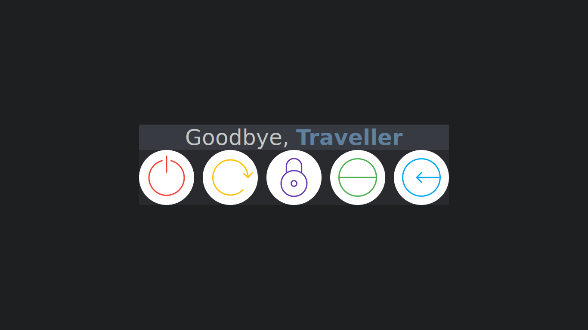

# About
Some simple menu program I wrote in order to use it as an exitscreen because oblogout was too heavy and hard to install.

# Installation 
``` sh
make
sudo make install
```

# Usage
There is no config file. The only way to customize it is by using cli arguments: 
- `B` - Application background 
- `b` - Button's background 
- `t` - Text message above buttons(pango can be used for additional formatting)
- `F` - Foreground message 
- `f` - Font used
- `T` - Font clor
- `s` - button spacing
- `a` - Add a button. Syntax "<key>|<command>|<normal_background>|<hover_background>|<icon_path>"

# Example
For example usage see `./example`

# Screenshot

